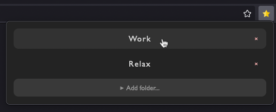

# Shark Bookmarks Folder Opener

Open all bookmarks from a given folder in new window with just two click.



## Browsers

Extension was tested on Mozilla Firefox 92.

## Setup

Technologies:

- TypeScript
- Vue 3 with TSX and styled components for UI
- Parcel 2 as a build tool

### Development

```sh
# install dependencies
npm i

# start watching source and run rebuild on changes
npm run dev
```
### Build extension for publish

```sh
# install dependencies
npm i

# build source and zip extension
npm run build
```
